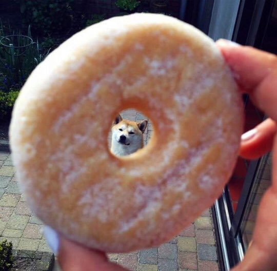
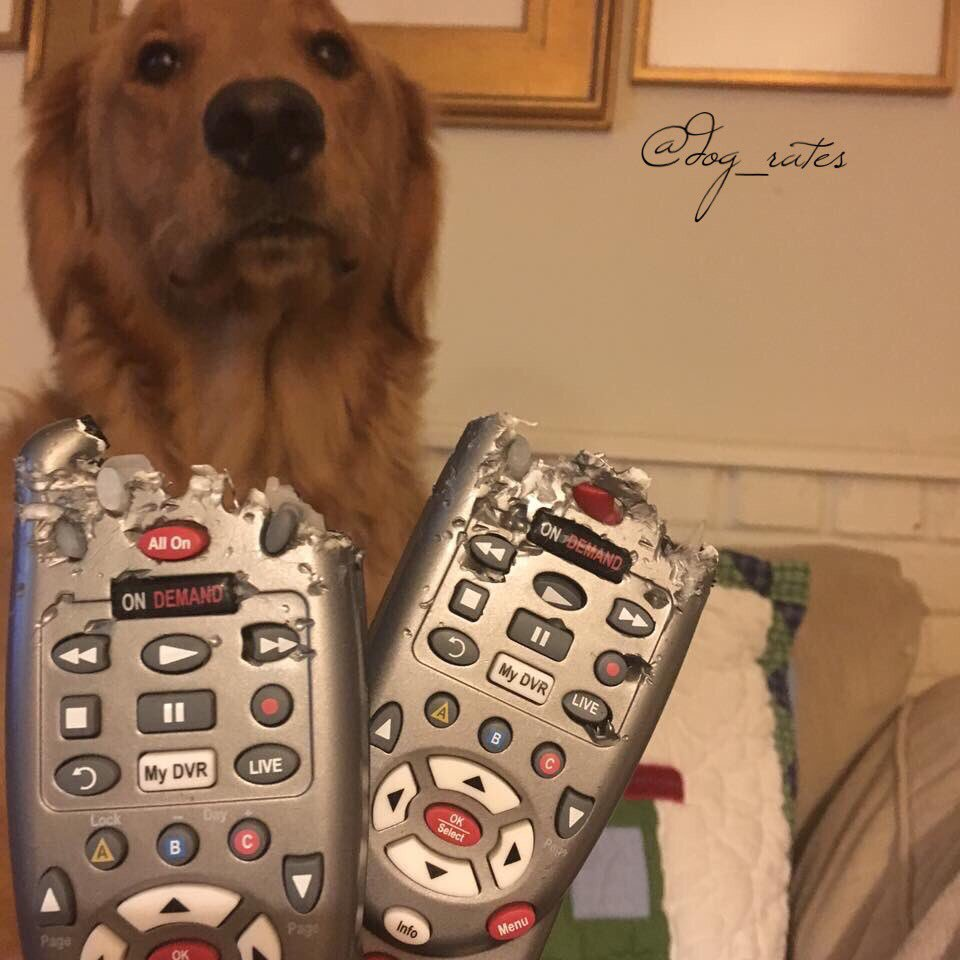
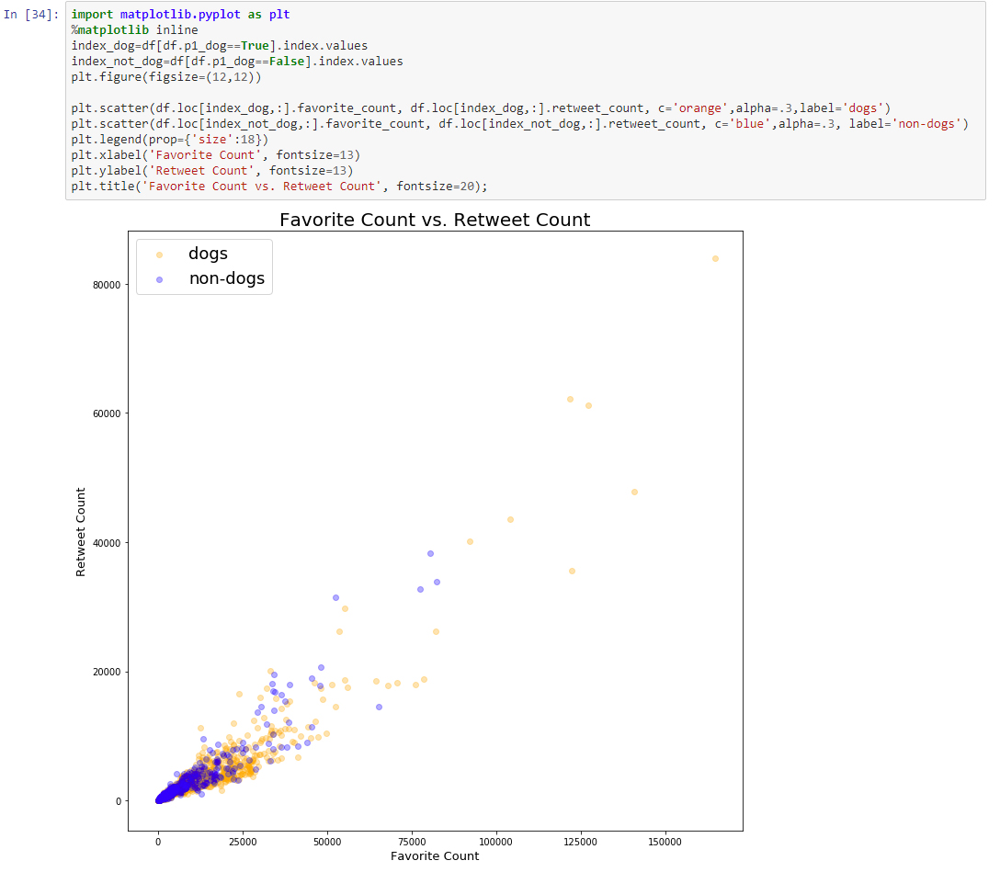

# OVERVIEW
This is Udacity's fourth project under Data Analyst Nanodegree Program. This project focused on gathering , assessing for quality and tidiness, and cleaning data .  (Completed on December 9, 2018)

This project focused on gathering data from a variety of sources and formats, assess its quality and tidiness, then cleaning the data.

The data we used was from the WeRateDogs Twitter archive. WeRateDogs is a lovable Twitter account that showcases dogs across the globe by simply uploading people's dogs along with a rating and some sort of comical comment. I do want to say ahead of time that these ratings are all in good humor. Ratings are scored out of 10 points but, almost always a dog would receive a rating greater than 10. For our project, we have gathered over 5000+ tweets from a variety of sources and have cleaned and organized our data. Our data includes information about a tweet's id, timestamp, image source, breed prediction, and much more.

We gathered data from three different sources: downloaded data manually through a given csv file, downloaded data programmatically using Python's request library and the given url and lastly, we imported data through Twitter's API. I had great difficulty gathering data through Twitter’s API and failed numerous times.

During our Assessment stage, I discovered that my data had a great number of quality and tidiness issues that I wished to fix but our project made clear that this would be time consuming and requested that we focus on eight quality issues and two tidiness issues. For our quality issues, I had removed retweets from our dataset since we only want to be analyzing original tweets. I noticed that some values under the text variable would state a specific phrase “we only rate dogs” which led me to discover that this would more than likely indicate our tweet was not of a dog. Other quality issues that I had cleaned up were issues such as incorrect mapping of dog names, incorrect data type, and inconsistency under the breed prediction where some breed names would be uppercase and some would be lowercase. To help with our dataset’s tidiness, I deleted unnecessary variables such as those that dealt with retweets, and created an additional table for our source variable to give a cleaner look. After our datasets were all cleaned up, I merged our datasets together to create a master dataset that would consist of all of a tweet’s information.

I would definitely consider this project to be one of the most difficult project in our course to date and at the same time, I would also say that this project pushed me beyond my comfort zone and caused me to gain a far greater understanding of the various data analysis tools Python offers. After a great amount of time spent on cleaning our data, I definitely have a great appreciation for datasets that have gone through the wrangling process!

***

# FINDINGS

## Most Average Favorited and Retweets By Dog Breed

I was first curious at what were the top breeds that received the most average favorited and retweets count. Although we would not be able to detect with complete confidence what breed of dog a tweet is referring to, for the sake of this analysis, we worked under the assumption that our neural network's first breed prediction is a completly accurate one.

Our top 'breeds' under most average favorited count were laptop, limousine, conch, foutain, arabian camel, bubble, orange, beaver, prison, and revolver. Our top 'breeds' under most average retweeted count were arabian camel, conch, upright, bubble, gondola, beaver, laptop, revolver, prison and remote control. Initially, I was pretty baffled at the results since it is pretty obvious that none of these dog 'breeds' are actually breeds. Curious, I went ahead and took a closer look at these individual tweets that fall under these so called 'breed'.

Our neural network had predicted the above photo to showcase an orange. Obviously this is not an orange but a photo of a bagel positioned in a manner that would frame a dog's head.

What our neural network predicted to be a remote control, was in fact an image of a remote control but also included in the background an image of a dog. It looks like the neural network may have trouble predicting the breed if more than one object appears in the photo. From our observations above, the prediction groups with the most average favorite and retweet counts mostly comes from photos that our neural networks predicts to be not of dogs. Most of these photos in actuality are of dogs but also contains inanimate objects which may have led to our neural network's confusion in prediction. In the eyes of our twitter audience, the favorite count and retweet count could be due to the photo's creativity of combining a dog with an inanimate object.

## Dog Breeds Vs Non Dog Breeds

This led me to wonder what if we compared number of favorited and retweeted count predicted to be of dogs to those predicted to be of nondogs.

The average favorite count for our predicted dog group is 8922.69. The average retweet count for our predicted dog group is 2627.80. The average favorite count for our predicted non-dog group is 7512.94. The average retweet count for our predicted non-dog group is 2538.42. On average, those tweets that were predicted to be of dogs, have a higher favorite/retweet count compared to tweets that were predicted to be of non-dogs.

The graph above shows that those tweets predicted to be dogs have far more outliers that those tweets predicted to be of nondogs.

## Pet Names

Our next analysis looked into our most common dog names under our WeRateDogs dataset. We discovered that Lucy, Charlie, Cooper, Oliver, Penny, and Tucker were the most common names with Lucy and Charlie in a tie with 11 dogs. This made me wonder if dogs of unique names (defined to be only 1 dog with that particular name in our dataset) would have a higher average favorite and retweet count compared to dogs with common names. Our findings show that the average count for favorited tweet under unique names is 8551.44 and the average count for retweets is 2466.25. The average count for favorited tweet under common names is 8344.27 and the average count for retweets is 2664.91. The average count for favorite tweet is slightly higher for unique names but slightly lower for retweets.
